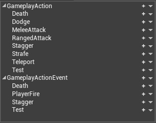
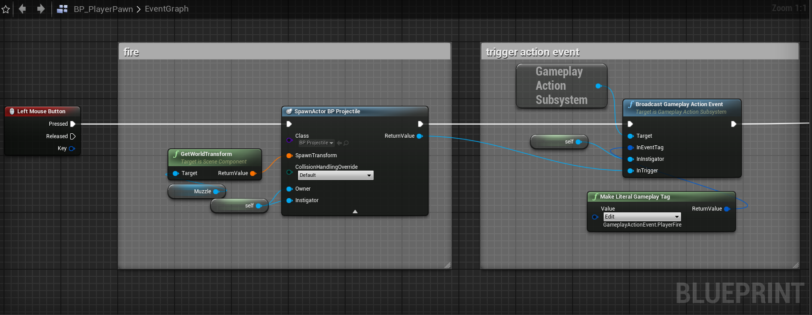
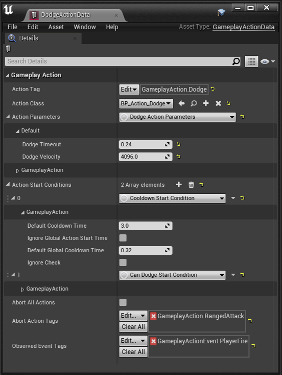
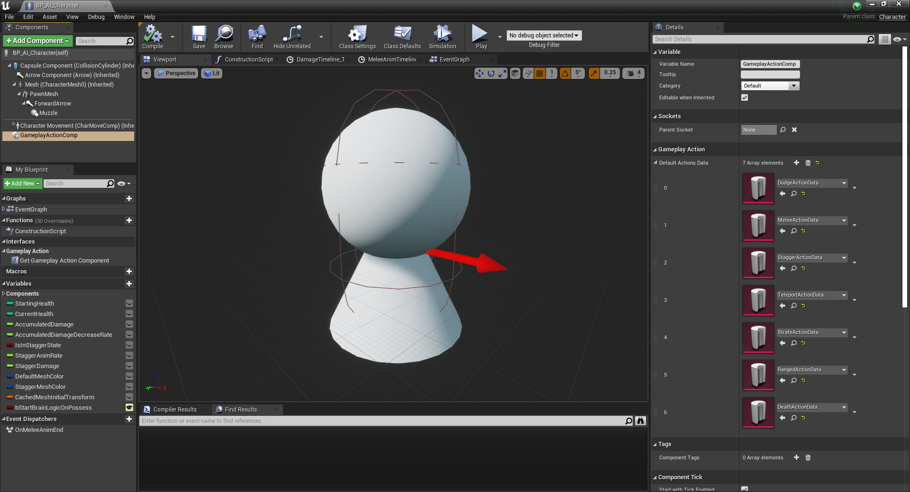
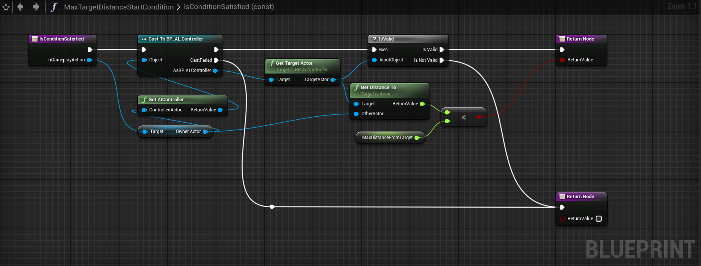
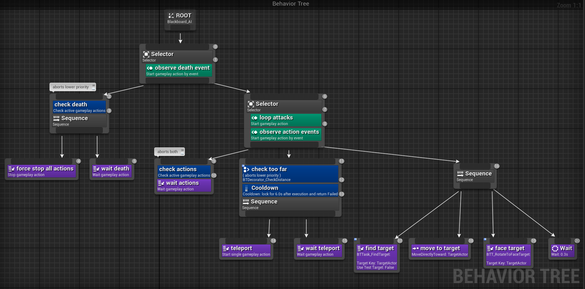
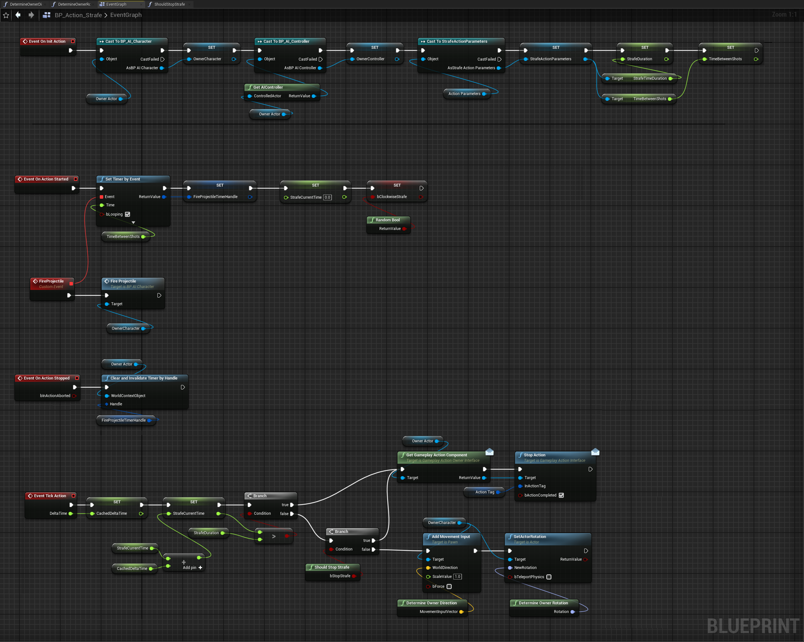

# Test project for the gameplay actions plugin - a plugin for simple gameplay AI logic, that integrates with behavior trees

The plugin source code is included in this project.
The idea is to provide a data-driven approach to add new behaviors, that is, gameplay actions, to an actor. A use case scenario could be a simple enemy AI that can chase and attack the player with melee and ranged attacks.
This plugin is the improved version of an old system I made (see the notes below for more info on this).

The heart of the system is the gameplay action component, which is also the interface for the gameplay code, in order to use the gameplay actions.
Initially, I started working on this system by extending the ability system component in a derived class, and referencing it directly in the gameplay code (behavior tree nodes), but I later realized that all I needed was a much simpler component. Basically, I just needed to configure and run some actions on the AI, like a melee attack, in a simple and data-driven way. So I created an interface and then implemented it in a custom gameplay action component, which is a plain actor component. Having started working on this plugin with the ability system in mind, I molded the interface in a way that should make it possible to swap my custom component implementation with the ability system component or a similar component.

## The plugin

These are the main parts of the plugin.

### IGameplayActionInterface
The interface for the gameplay code to interact with the actions of a specific actor. It is supposed to be implemented by an actor component. It mainly provides the functions to add, remove, start, stop the actions, and to register for events such as action started or stopped. This interface is the only thing the gameplay code should reference in order to use the gameplay actions, for example that's what the behavior tree nodes provided with this plugin do (the nodes don't know anything about the actual component implementation). It heavily relies on gameplay tags, which represent the actions, to abstract away the actual action implementation details.

### UGameplayActionComponent
The actor component that implements the interface. Aside from implementing the virtual functions of the interface, this component does the dirty work of setting up the actual actions data, and mapping the gameplay tags - passed as parameters of the virtual functions, to such data. The gameplay code that needs to interact with the gameplay actions doesn't need to (and shouldn't) know anything about this component inner workings, nor reference it directly. The actor that owns this component, should also implement the IGameplayActionOwnerInterface (not to be confused with the IGameplayActionInterface), which simply provides a way to return the gameplay action component.

### UGameplayAction
The actual action object mapped to a specific gameplay tag. This is a UObject that is created and owned by the gameplay action component (it mimics the gameplay ability object, more or less). It is simple on purpose, it basically starts and stops the action without any complex check or validation. That's because it isn't supposed to be referenced directly - that's why the interface exists. It is the component's duty to orchestrate the actions and determine things like whether an action can start or not. In other words, It is a dumb object whose only purpose is to perform the actual action logic.

### UGameplayActionData
A data asset that holds all the data related to a single action. Basically, it defines the mapping of an action tag to the actual action object, but it also provides a way to configure the condition checks to start the action (e.g. for a melee attack, if the AI is close enough to the player), its parameters, and defines the action tags that can be aborted by this action. The action component is supposed to load/reference these data assets (one per action), and provide a way to map the action tag to the matching data asset. This object represents the data-driven part of the system.

### Behavior tree nodes
As I mentioned earlier, this plugin is based on a relatively simple AI logic I made a long time ago, for some enemies whose logic was (for the most part) about chasing and attacking the player. That logic was based on behavior trees, but the main issue of my old system is that it required changing many things in order to add and use a new AI logic, such as a ranged attack. With this plugin I attempted to address that issue, and it should be fairly easy to add new logic (actions) and integrate it in the behavior tree, with the tree nodes the plugin provides.

## The test project

This test project includes a simple AI character that basically chases and attacks the player, but also perfroms actions such as dodging projectiles, or staggering if taking a high amount of damage in a short timespan.
The following notes cover the main concepts of the setup of this project, which should help to figure out how the plugin is supposed to be used.

### Gameplay action tags

This image shows the action tags that are available in this project. The action tag is basically a label that is mapped to the the actual action (see setup below). The event tag is supposed to be used as a trigger, which can eventually start an action. For example, the "player fire" event can be used to trigger the "dodge" projectile action on the enemies.

### Setup

These are the main steps to setup a new action:
* add an action tag and optionally an action event tag (if an action can be triggered by an event)
* create the action object
* create the action data asset (this is where the action tag is mapped to the actual action object)
* add the action data asset to the gameplay action component of the controlled character
* handle the new action and event tags in the behavior tree nodes (see below)

Optionally, the action data asset can define other data such as the start conditions and the action parameters. Important! These are EditInline/Instanced UObjects that are referenced directly by the gameplay action component, and must be treated as const objects - a change at runtime to these objects will be reflected to the data asset which can then be saved accidentally! The data asset could be refactored not to use these objects this way/directly, but this should not be a problem if such objects are used correctly. The nice thing about using objects for start conditions is that they can implement logic in functions. For example, the image below shows the start condition used by melee attack in order to check if the player is close enough to the player.

### Behavior tree

The setup of the behavior tree should mostly consists of adding new action/event tags to the properties of the service/decorator/task nodes.
This is the interesting part of the behavior tree: the actions can be handled through generic nodes, if no special action handling is needed. This is how dodge, melee/strafe/ranged attacks, stagger actions are handled. Basically, the service tries to start the action, the decorator checks if the action is active and optionally aborts self and/or lower priority nodes, and the task just waits for the action to stop. One important thing to note is that the abort logic of the behavior tree tasks shouldn't be confused with actions abort logic. Usually they overlap, meaning that, for example, if an action aborts another action, a behavior tree decorator could then abort self/a lower priority node. But that's not always the case. For example, in this test project the teleport action can be aborted by death only, but will never be aborted by other actions (e.g. dodge), even if these are handled in a higher priority branch, because such actions do not have the teleport action set as an abort tag.

### Gameplay action object
The action object is an object that is instanced per actor (or, more precisely, per actor component). This means that every actor (i.e. pawn/character) that uses the gameplay action component, has its own instance of the object. This helps to keep the object logic simple. Since this is where the action logic resides, I think it is worth describing some parts of its inner workings. All this object has to do, is to handle the actual logic of the action, through the provided blueprint native events (init/start/stop/event/tick). The init function is called only when the action is added to the component, and is a good place to cache constant data. The stop function is supposed to clear and reset anything that has been set in the start function. The tick function is disabled by default and, by default, is called only when the action is active. Note that the action object should be considered as gameplay code, meaning that the action object isn't supposed to know anything about the gameplay action component, but should use the gameplay action interface instead, if needed. For example, the following image shows the dodge action logic, where the action stops itself by calling the the stop function on the interface.

## Caveats
* avoided overly defensive code, just make sure to to follow the simple rules of the system; there are many ensures though, which should help to spot errors in the setup
* multiple actions can run simultaneously, but the main logic is supposed be based on one active action at a time, at least this is how I handled the actions in this project; for example, an AI could have a strafe action, and could perform a ranged attack action while strafing (in this project, the strafe action defines its own ranged attack logic though)
* the underlying concept of this system is heavily influenced by an old system I made for an actual game years ago, but this plugin has been put together very quickly, it has not be tested thoroughly, and is not used in production
* actually for UE4.27 only; I attempted to refactor my old system years ago, but I eventually couldn't complete the refactor; lately, I strived to come back to it and get something done for release, so I started working on this plugin and I tried to reuse the logic I made in older Unreal Engine versions; once again, this plugin deserves more testing
* replication is not handled on purpose, even though is something I wanted to support (fun fact, my old system supported replication...)

## Possible enhancements

This a list of possible improvements I thought about while working on this plugin, which I eventually discarded; I wanted this plugin to be focused on the simplest gameplay action logic possible. I haven't planned to support this plugin, unless I find a critical bug.

* action "stack" or some kind of memory to know the previous action history
* action save logic
* action replication
* frame time budget for action start condition checks
* latent action stop
* level-based action configuration for game difficulty handling
* actions priority

## Links
* Unreal Forums link
* YouTube link

